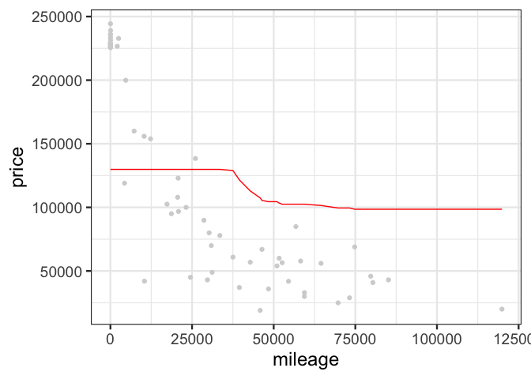

Exercise 2
================

## GitHub Documents

This is an R Markdown format used for publishing markdown documents to
GitHub. When you click the **Knit** button all R code chunks are run and
a markdown file (.md) suitable for publishing to GitHub is generated.

## Including Code

    ## [1] 416  17

<!-- -->

    ## [1] 10361.62

<!-- -->

    ## [1] 10365.19

<!-- -->

    ## [1] 9598.834

<!-- -->

    ## [1] 9756.113

<!-- -->

    ## [1] 9661.95

<!-- -->

    ## [1] 10643.25

<!-- -->

    ## [1] 17062.38

\#\#hallo

    ## [1] 292  17

<!-- -->

    ## [1] 27578.34

<!-- -->

    ## [1] 24374.9

<!-- -->

    ## [1] 23240.57

<!-- -->

    ## [1] 24109.99

<!-- -->

    ## [1] 27972.41

<!-- -->

    ## [1] 37334.16

<!-- -->

    ## [1] 71973.85
