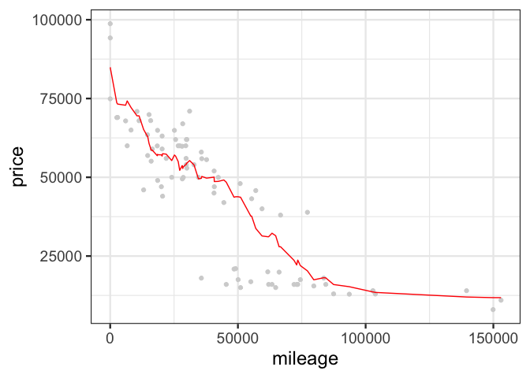
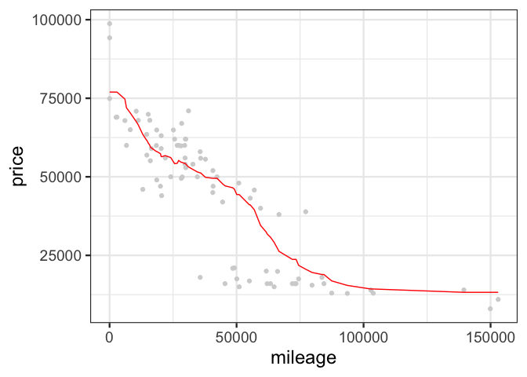
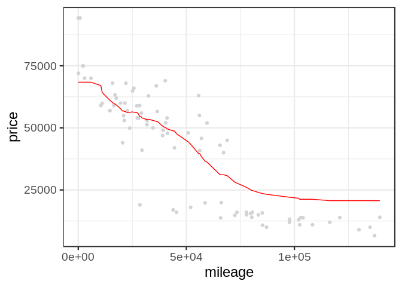
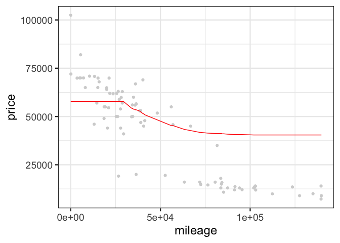
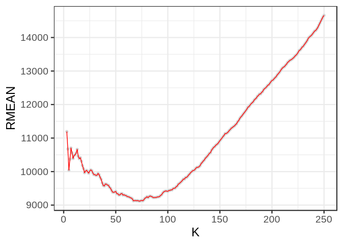
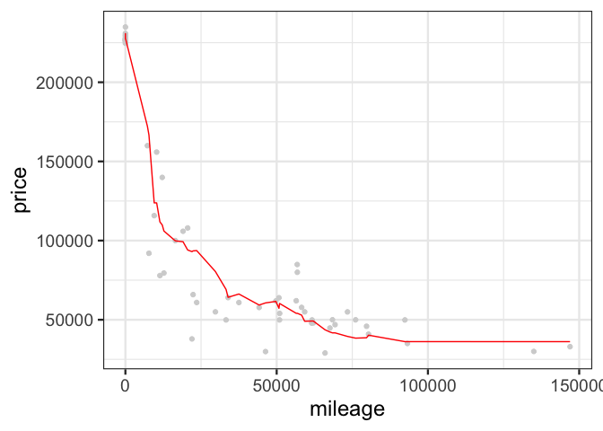
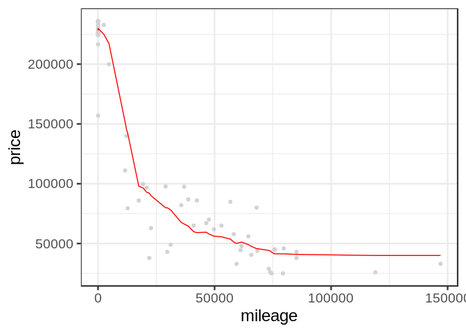
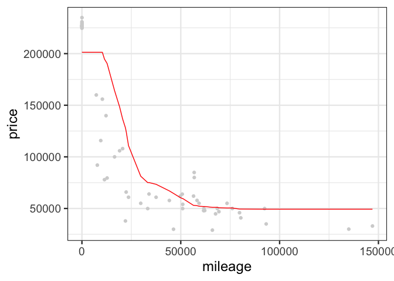
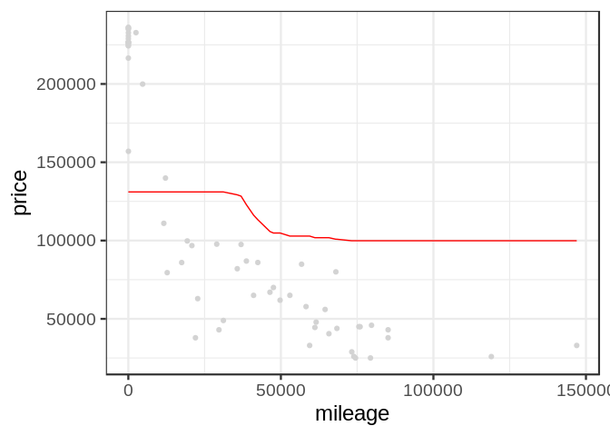
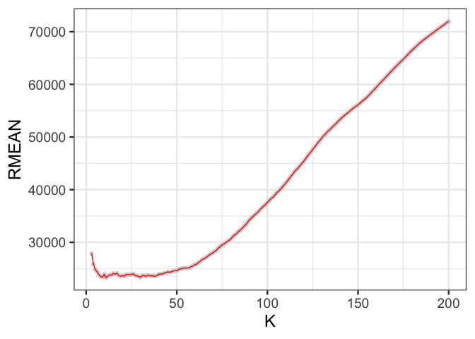

Exercise\_2
================

## GitHub Documents

This is an R Markdown format used for publishing markdown documents to
GitHub. When you click the **Knit** button all R code chunks are run and
a markdown file (.md) suitable for publishing to GitHub is generated.

## Including Code

    ## [1] 416  17

<!-- -->

    ## [1] 10320.69

<!-- -->

    ## [1] 9306.616

<!-- -->

    ## [1] 9025.594

<!-- -->

    ## [1] 9537.15

<!-- -->

    ## [1] 10049.23

<!-- -->

    ## [1] 12436.6

<!-- -->

    ## [1] 20001.48

<!-- -->

# sclass\_65

    ## [1] 292  17

<!-- -->

    ## [1] 21144.36

<!-- -->

    ## [1] 20142.84

<!-- -->

    ## [1] 20570.59

<!-- -->

    ## [1] 20151.27

<!-- -->

    ## [1] 20827.62

<!-- -->

    ## [1] 38314.79

<!-- -->

    ## [1] 75308.98

<!-- -->
