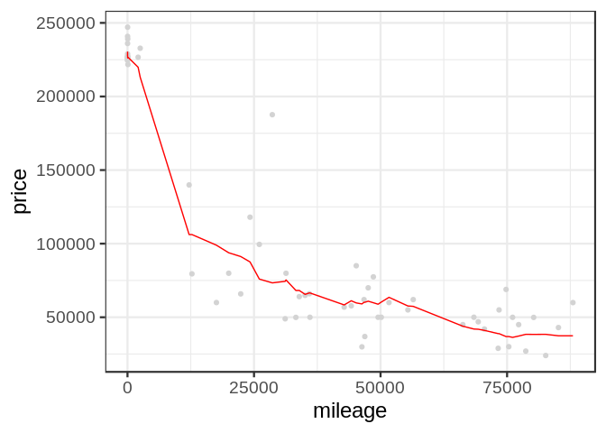
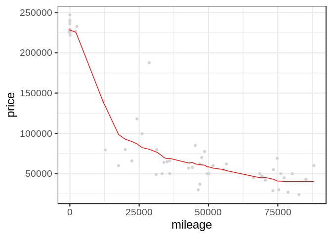
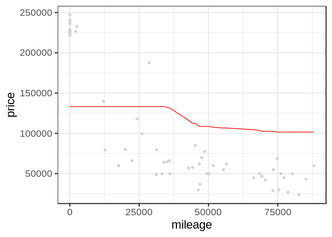

Exercise\_2
================

## GitHub Documents

This is an R Markdown format used for publishing markdown documents to
GitHub. When you click the **Knit** button all R code chunks are run and
a markdown file (.md) suitable for publishing to GitHub is generated.

## KNN Practice

We wil be using the K-nearest neighbors technique to predict the price
of Mercedes S Class vehicles based on gas mileage. We will be
distinguishing these S Class vehicles by trim. In particular, we will be
focusing on just two values of trim: 350 and 65 AMG, and finding optimal
values of K for predicting the price of each.

# KNN functions for 350 trim vehciles

    ## [1] 416  17

<!-- -->

    ## [1] 11847.07

<!-- -->

    ## [1] 11063.13

<!-- -->

    ## [1] 10708.52

<!-- -->

    ## [1] 10784.93

<!-- -->

    ## [1] 11158.3

<!-- -->

    ## [1] 12366.65

<!-- -->

    ## [1] 17835.59

Here we plot the average RMSE for each value of K from 3 to 250, and
find that the optimal value of K is

<!-- -->

# 65 AMG

    ## [1] 292  17

<!-- -->

    ## [1] 18121.99

<!-- -->

    ## [1] 17064.17

<!-- -->

    ## [1] 16939.4

<!-- -->

    ## [1] 18274.73

<!-- -->

    ## [1] 26557.62

<!-- -->

    ## [1] 39128.37

<!-- -->

    ## [1] 68063.88

    ## [1] 16939.4

write stuff here\!

<!-- -->
