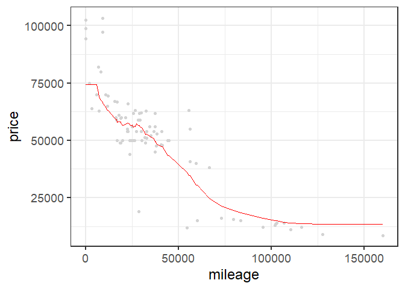
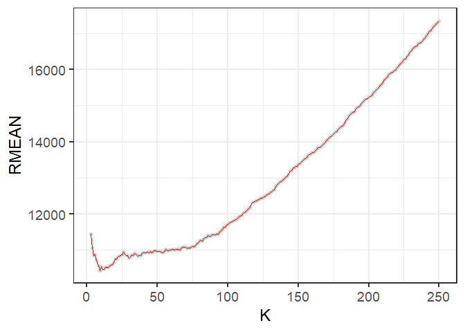
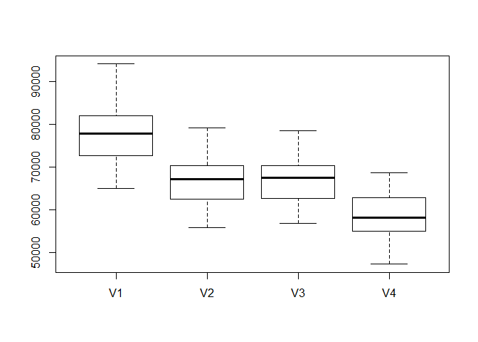

Exercise\_2
================

## GitHub Documents

This is an R Markdown format used for publishing markdown documents to
GitHub. When you click the **Knit** button all R code chunks are run and
a markdown file (.md) suitable for publishing to GitHub is generated.

## KNN Practice

We wil be using the K-nearest neighbors technique to predict the price
of Mercedes S Class vehicles based on gas mileage. We will be
distinguishing these S Class vehicles by trim. In particular, we will be
focusing on just two values of trim: 350 and 65 AMG, and finding optimal
values of K for predicting the price of each.

### KNN functions for 350 trim vehicles

    ## [1] 416  17

<!-- -->

    ## [1] 9917.903

<!-- -->

    ## [1] 9734.272

<!-- -->

    ## [1] 9350.246

Here we plot the average RMSE for each value of K from 3 to 250, and
find that the optimal value of K is 69

<!-- -->

### 65 AMG

    ## [1] 292  17

<!-- -->

    ## [1] 24585.49

<!-- -->

    ## [1] 22498.08

<!-- -->

    ## [1] 24931.13

Here we plot the average RMSE for each value of K from 3 to 200, and
find that the optimal value of K is 28

<!-- -->

### Conclusion

The optimal value of K is larger for the 350 trim vehicles than the 65
AMG. One explanation for this is that the sample set of 350 trim
vehichles is also larger than the set of 65 AMG vehicles. As the value
of K gets closer to the size of the entire sample, KNN becomes less
useful in estimating the price for a specific mileage value.

## Saratoga house prices

We will be building and comparing two models to predict the prices of
houses in Saratoga, New York. The first will be a linear model based on
features and feature interactions that we deem important in predicting
the prices of houses. The second will be a model that uses the same
features as the first but instead uses the K-nearest neighbors technique
to make predictions.

### The Data

The data that will be used to build these models is of houses in
Saratoga, New York in 2006. The data includes the price of each house
and various features that could potentially affect their price such as
living area, land value, age, number of rooms, etc.

### Feature selection

To build these models, we need to determine which features are important
in predicting the price of a house, and which can be safely discarded.
To start, we decided to not include the sewer type, heating type, and
number of fireplaces as these are generally not the primary concerns of
people in the market for a new house. Here is a boxplot of how a linear
model using these features performed against the 3 sample models
discussed in class:

<!-- -->

### Interactions

Next, we need to determine if there are any interactions between the
features that we’ve selected. That is, do any of the features’ effect on
price change based on the value of another feature. For instance, we
predicted that lot size would not have a strong effect on price unless
it is significantly larger than the houses living area, otherwise it’s
effect would be overshadowed by the living area’s effect on price. We
predicted that the number of bedrooms and bathrooms a house has would
also interact with the living area of the house because the two are
directly corrleated. However, the model performed worse when considering
these interactions, so we decided to discard them in the final model.

### KNN

Now we will attempt to improve on our linear model by using the same
features, but instead building the model based on the K-nearest
neigbhors technique. This will make a price prediction for a given house
based on the K most similar houses in the data set. We will be choosing
a value of K by testing which values make the most accurate predictions.
Here are values of K plotted against their model performance:

<!-- -->

This shows that the optimal value of k is 5. Here is a boxtplot of the
performance of the three sample models, our linear model, and our
K-nearest neighbors model using K=5:

<!-- -->

As you can see, the K-nearest neighbor model outperformed each of the
sample models, but did worse than our linear model.

### Conclusion

Both the linearn and KNN models consistently outperform the sample
models, indicating that sewer type, heating type and number of
fireplaces do not have a strong effect on the price of houses compared
to the rest of the features used. In addition, two of the sample models
discarded waterfront and land value while we included each of these in
our models, indicating that one or both are strong indicators of the
price of a house. Since it performed the best of the 5 models tested, we
recommend using our linear model to predict housing prices going
forward.
