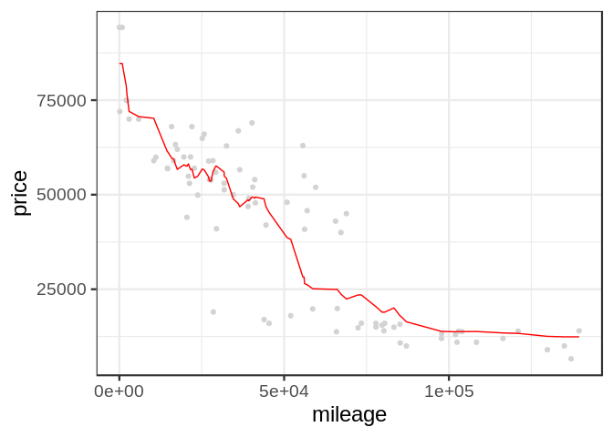
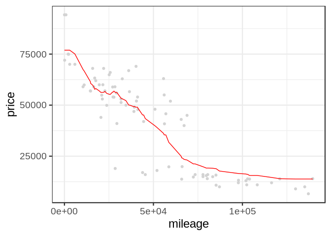
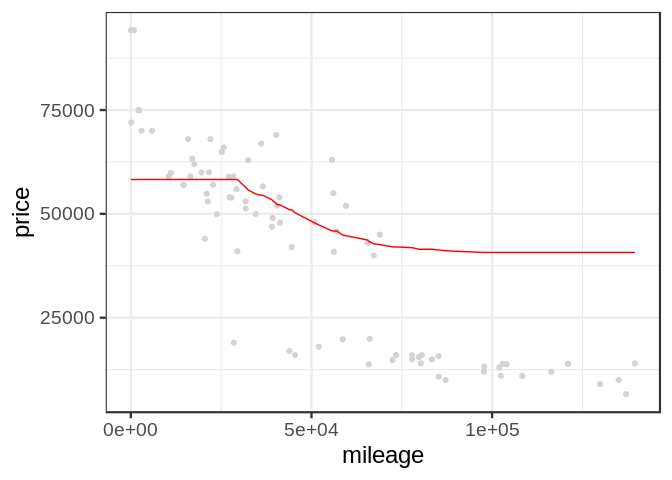

Exercise\_2
================

## GitHub Documents

This is an R Markdown format used for publishing markdown documents to
GitHub. When you click the **Knit** button all R code chunks are run and
a markdown file (.md) suitable for publishing to GitHub is generated.

## KNN Practice

We wil be using the K-nearest neighbors technique to predict the price
of Mercedes S Class vehicles based on gas mileage. We will be
distinguishing these S Class vehicles by trim. In particular, we will be
focusing on just two values of trim: 350 and 65 AMG, and finding optimal
values of K for predicting the price of each.

# KNN functions for 350 trim vehciles

    ## [1] 416  17

<!-- -->

    ## [1] 11262.72

<!-- -->

    ## [1] 9740.887

<!-- -->

    ## [1] 9569.883

<!-- -->

    ## [1] 9808.211

<!-- -->

    ## [1] 10166.67

<!-- -->

    ## [1] 11344.34

<!-- -->

    ## [1] 17985.58

Here we plot the average RMSE for each value of K from 3 to 250, and
find that the optimal value of K is

``` kplot
kframe <- data.frame("K" = c(), "RMEAN" =c())
i <- 3
while (i <= 250) {
  d = data.frame("K" = i, "RMEAN" = rmse(y_test, knn.reg(train = X_train, test = X_test, y = y_train, k=i)$pred))
  
  kframe = rbind(kframe, d)
  i = i + 1

}

k_vs_rmean = ggplot(data = kframe) + 
  geom_point(mapping = aes(x = K, y = RMEAN), color='lightgrey') + 
  theme_bw(base_size=18) + geom_path(aes(x = K, y = RMEAN), color='red')
k_vs_rmean

print(which kframe == min(kframe$RMEAN), arr.ind=TRUE)
```

# 65 AMG

    ## [1] 292  17

<!-- -->

    ## [1] 24517.79

<!-- -->

    ## [1] 21290.39

<!-- -->

    ## [1] 19735.25

<!-- -->

    ## [1] 19340.9

<!-- -->

    ## [1] 20513.41

<!-- -->

    ## [1] 33507.61

<!-- -->

    ## [1] 70033.17

<!-- -->

    ## [1] 18796.49
