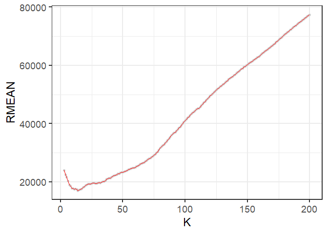
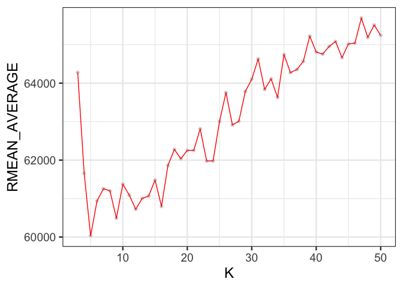

Exercise\_2
================

## GitHub Documents

This is an R Markdown format used for publishing markdown documents to
GitHub. When you click the **Knit** button all R code chunks are run and
a markdown file (.md) suitable for publishing to GitHub is generated.

## KNN Practice

We wil be using the K-nearest neighbors technique to predict the price
of Mercedes S Class vehicles based on gas mileage. We will be
distinguishing these S Class vehicles by trim. In particular, we will be
focusing on just two values of trim: 350 and 65 AMG, and finding optimal
values of K for predicting the price of each.

### KNN functions for 350 trim vehciles

    ## [1] 416  17

<!-- -->

    ## [1] 9917.903

<!-- -->

    ## [1] 9734.272

<!-- -->

    ## [1] 9350.246

Here we plot the average RMSE for each value of K from 3 to 250, and
find that the optimal value of K is 69

<!-- -->

### 65 AMG

    ## [1] 292  17

<!-- -->

    ## [1] 24585.49

<!-- -->

    ## [1] 22498.08

<!-- -->

    ## [1] 24931.13

Here we plot the average RMSE for each value of K from 3 to 200, and
find that the optimal value of K is 28

<!-- -->

### Conclusion

The optimal value of K is larger for the 350 trim vehicles than the 65
AMG. One explanation for this is that the sample set of 350 trim
vehichles is also larger than the set of 65 AMG vehicles. As the value
of K gets closer to the size of the entire sample, KNN becomes less
useful in estimating the price for a specific mileage value.

<!-- -->

    ##           V1       V2       V3       V4       V5
    ## 1   75006.91 67649.28 68379.46 61756.39 66152.46
    ## 2   88554.54 78038.63 78528.66 64561.73 66906.75
    ## 3   82025.02 70519.24 72211.30 59816.88 68254.27
    ## 4   78183.49 71910.33 71331.34 60988.96 62512.81
    ## 5   76039.12 66584.68 67112.82 52998.53 56920.20
    ## 6   76303.06 67040.29 66793.34 58562.54 59244.39
    ## 7   73744.97 61812.69 60871.66 56063.63 56273.30
    ## 8   78523.91 70039.33 69784.20 61999.30 62408.51
    ## 9   86328.40 77994.82 77091.60 71795.68 73358.66
    ## 10  84635.77 74591.24 74453.97 65739.20 68391.52
    ## 11  86174.94 75409.38 74736.52 62835.30 68145.74
    ## 12  81294.01 68137.22 68070.88 63591.37 67612.98
    ## 13  78454.39 63535.33 63364.88 54321.69 56782.52
    ## 14  69775.35 58691.43 58262.89 53420.47 56656.50
    ## 15  80173.20 71604.25 70946.72 60513.87 62090.46
    ## 16  75499.56 65205.58 65284.28 60228.49 59225.44
    ## 17  74162.04 62852.76 62786.53 57097.79 57298.80
    ## 18  74193.05 64447.52 64427.49 59590.62 57775.27
    ## 19  77250.56 68254.47 70320.24 63171.17 62387.97
    ## 20  82239.39 70998.72 70115.44 59101.10 63225.30
    ## 21  81968.97 72294.51 71808.94 64218.96 68262.38
    ## 22  75846.94 67341.01 67099.77 58530.83 58447.04
    ## 23  77796.53 64973.65 65158.26 62951.32 61051.88
    ## 24  73789.33 64479.26 63744.74 50602.37 53931.97
    ## 25  75820.07 64477.77 66160.91 57540.44 57870.65
    ## 26  72974.90 65226.30 64574.64 57129.60 56112.10
    ## 27  73441.87 63166.45 62275.51 56512.84 58534.10
    ## 28  81450.12 72390.61 72129.97 64727.40 65145.57
    ## 29  75465.16 63851.51 63394.59 53920.45 57284.90
    ## 30  76412.58 64577.80 64756.05 57792.21 63715.43
    ## 31  79312.87 67964.21 67300.25 62754.86 65158.82
    ## 32  82027.21 72038.84 71271.24 64522.27 67283.23
    ## 33  74467.68 61179.49 60722.47 49894.91 54832.72
    ## 34  75993.24 66977.58 66297.77 58013.74 62156.13
    ## 35  79745.12 65524.09 65807.54 57284.53 59035.68
    ## 36  71641.81 62686.74 63486.23 56112.09 56690.06
    ## 37  82335.79 68114.70 67532.55 62481.45 60331.40
    ## 38  77142.69 65377.99 65860.56 59764.06 60904.40
    ## 39  76805.50 65620.45 65568.20 56336.73 57519.12
    ## 40  85711.44 74176.99 74187.70 65729.56 67487.31
    ## 41  75829.40 67979.61 67310.82 61587.99 62620.33
    ## 42  78627.83 67844.41 67617.10 61992.58 63393.46
    ## 43  69376.44 61629.44 62959.85 54307.32 57031.14
    ## 44  80069.05 70918.83 70709.75 59064.96 59040.48
    ## 45  73914.78 62042.51 62383.73 57994.51 59840.24
    ## 46  74966.40 63473.73 63094.74 57901.74 59089.47
    ## 47  80877.18 64736.51 64330.46 60210.32 59996.31
    ## 48  77230.00 66758.51 67206.08 56655.29 58875.64
    ## 49  77182.15 66599.95 66368.97 57382.45 61201.82
    ## 50  70709.28 62838.13 62268.73 49681.49 56193.66
    ## 51  72668.85 60513.84 61184.08 55647.69 57036.78
    ## 52  83683.06 71460.96 72706.24 63719.22 68217.58
    ## 53  75026.94 64700.32 64259.15 53972.97 59907.67
    ## 54  92179.63 79221.92 79133.21 67177.81 71808.14
    ## 55  74774.59 60629.84 59823.82 55479.44 61187.98
    ## 56  84703.02 73112.84 73425.93 63480.85 65572.07
    ## 57  78469.55 66983.92 66535.48 54273.39 57327.92
    ## 58  76429.29 65248.13 65089.88 62120.75 63338.10
    ## 59  77460.50 66369.97 65665.08 58431.97 62508.38
    ## 60  67812.47 58327.41 58463.69 52609.55 53995.13
    ## 61  76524.96 67127.42 67229.38 59653.71 61093.62
    ## 62  73971.92 60129.64 61023.69 53489.08 55336.89
    ## 63  84424.27 72249.89 71865.18 61485.87 64021.06
    ## 64  74577.12 62932.96 62444.71 54234.46 52241.37
    ## 65  84534.29 70200.86 69489.94 62716.21 65074.58
    ## 66  77702.75 65596.09 64790.44 57185.25 59610.19
    ## 67  70736.44 63921.51 64435.10 57095.87 58765.10
    ## 68  79437.08 69057.08 68377.67 58327.67 64937.72
    ## 69  79471.40 66600.56 66138.81 57034.15 56309.77
    ## 70  79029.29 69277.56 69626.70 61935.03 64365.43
    ## 71  85211.81 74969.70 74241.11 61933.07 70391.97
    ## 72  84973.66 71398.52 70783.34 61108.99 63693.29
    ## 73  81214.85 69528.70 69321.96 66188.29 66678.79
    ## 74  80701.84 67904.40 67133.40 62016.80 61301.45
    ## 75  66420.57 57767.13 58781.92 55827.56 58890.67
    ## 76  76880.16 66313.61 66759.96 58616.92 64701.03
    ## 77  79815.50 66365.80 65918.91 60485.31 62252.43
    ## 78  81366.47 69961.73 70884.40 63404.77 64266.81
    ## 79  85124.61 75354.59 75030.85 60806.08 66143.10
    ## 80  73598.72 59779.76 59313.15 50585.45 56578.22
    ## 81  80423.90 66308.83 65897.04 56087.34 62469.98
    ## 82  77189.00 69887.16 69054.41 63435.59 64987.96
    ## 83  73962.93 68582.34 71098.83 61096.30 58775.52
    ## 84  86800.16 75445.43 74466.06 66256.08 66025.92
    ## 85  75074.58 64200.96 64228.94 56934.00 56466.50
    ## 86  81516.60 69721.48 69795.99 59665.29 61071.37
    ## 87  77018.64 65010.72 64522.36 52931.95 60398.54
    ## 88  78675.14 63117.52 62569.82 52662.00 56940.18
    ## 89  73417.79 65337.17 65927.99 58464.58 57997.58
    ## 90  83955.57 72808.92 72842.45 58247.91 64486.72
    ## 91  81407.48 73448.83 72825.30 64144.23 67402.81
    ## 92  76209.25 63063.31 62433.16 59354.94 59504.14
    ## 93  78203.21 67397.54 67808.47 59950.85 61525.50
    ## 94  75353.71 61029.33 62606.46 55849.12 59992.54
    ## 95  75583.65 64064.16 63052.82 58189.44 56710.20
    ## 96  78394.64 73136.29 73459.60 66439.27 67503.57
    ## 97  76453.47 65895.36 66382.76 60429.97 58154.28
    ## 98  80318.26 71144.94 70801.78 58960.59 64401.35
    ## 99  76594.76 63484.51 63871.15 60393.86 61815.81
    ## 100 84540.46 72956.88 73343.36 61467.29 67413.11

    ##       V1       V2       V3       V4       V5 
    ## 78175.13 67316.27 67251.28 59237.59 61522.58

<!-- -->
