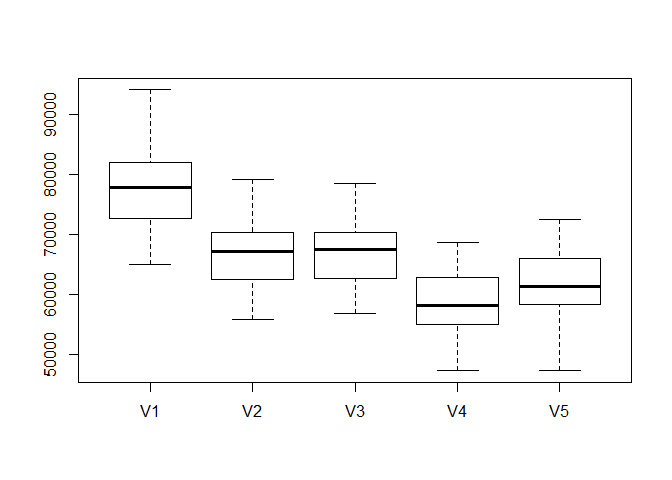

Exercise\_2
================

## KNN Practice

We wil be using the K-nearest neighbors technique to predict the price
of Mercedes S Class vehicles based on gas mileage. We will be
distinguishing these S Class vehicles by trim. In particular, we will be
focusing on just two values of trim: 350 and 65 AMG, and finding optimal
values of K for predicting the price of each.

### KNN functions for 350 trim vehicles

Here we plot the average RMSE for each value of K from 3 to 250, and
find that the optimal value of K is 9

<!-- -->

### 65 AMG

Here we plot the average RMSE for each value of K from 3 to 200, and
find that the optimal value of K is 14

<!-- -->

### Conclusion

The optimal value of K is larger for the 350 trim vehicles than the 65
AMG. One explanation for this is that the sample set of 350 trim
vehichles is also larger than the set of 65 AMG vehicles. As the value
of K gets closer to the size of the entire sample, KNN becomes less
useful in estimating the price for a specific mileage value.

## Saratoga house prices

We will be building and comparing two models to predict the prices of
houses in Saratoga, New York. The first will be a linear model based on
features and feature interactions that we deem important in predicting
the prices of houses. The second will be a model that uses the same
features as the first but instead uses the K-nearest neighbors technique
to make predictions.

### The Data

The data that will be used to build these models is of houses in
Saratoga, New York in 2006. The data includes the price of each house
and various features that could potentially affect their price such as
living area, land value, age, number of rooms, etc.

### Feature selection

To build these models, we need to determine which features are important
in predicting the price of a house, and which can be safely discarded.
To start, we decided to not include the sewer type, heating type, and
number of fireplaces as these are generally not the primary concerns of
people in the market for a new house. Here is a boxplot of how a linear
model using these features performed against the 3 sample models
discussed in class:

<!-- -->

### Interactions

Next, we need to determine if there are any interactions between the
features that we’ve selected. That is, do any of the features’ effect on
price change based on the value of another feature. For instance, we
predicted that lot size would not have a strong effect on price unless
it is significantly larger than the houses living area, otherwise it’s
effect would be overshadowed by the living area’s effect on price. We
predicted that the number of bedrooms and bathrooms a house has would
also interact with the living area of the house because the two are
directly corrleated. However, the model performed worse when considering
these interactions, so we decided to discard them in the final model.

### KNN

Now we will attempt to improve on our linear model by using the same
features, but instead building the model based on the K-nearest
neigbhors technique. This will make a price prediction for a given house
based on the K most similar houses in the data set. We will be choosing
a value of K by testing which values make the most accurate predictions.
Here are values of K plotted against their model performance:

<!-- -->

This shows that the optimal value of k is 5. Here is a boxtplot of the
performance of the three sample models, our linear model, and our
K-nearest neighbors model using K=5:

<!-- -->

As you can see, the K-nearest neighbor model outperformed each of the
sample models, but did worse than our linear model.

### Conclusion

Both the linear and KNN models consistently outperform the sample
models, indicating that sewer type, heating type and number of
fireplaces do not have a strong effect on the price of houses compared
to the rest of the features used. In addition, two of the sample models
discarded waterfront and land value while we included each of these in
our models, indicating that one or both are strong indicators of the
price of a house. Since it performed the best of the 5 models tested, we
recommend using our linear model to predict housing prices going
forward.

## Predicting when articles go viral

We will be building two models to predict whether a given article on
Mashable.com will go viral or not. An article is classified as viral if
it receives greater than 1400 shares. The first model will be trained to
predict shares as a target variable, and then classify it as viral if it
predicts greater than 1400 shares. The second model will be trained to
predict virality as it’s target variable, ignoring the number of shares
and only focusing on whether or not an article went viral.

### The Data

We will be using data on 39,797 online rticles published by Mashable
during 2013 and 2014. This data contains information on each article
such as the length of it’s title, the length of the article itself, and
the positivity/negativity of the words used in the article. The features
we will be focusing on to train our two models are listed below:

  - num\_imgs: Number of images.
  - n\_tokens\_title: Number of words in the title.
  - data\_channel\_is\_entertainment: Is the data channel
    “entertainment”?
  - data\_channel\_is\_world: Is the data channel “World”?
  - data\_channel\_is\_socmed: Is the data channel “Social Media”
  - self\_reference\_avg\_shares: The average number of shares of other
    mashable articles linked to from this article
  - global\_rate\_positive\_words: Rate of positive words in content
  - global\_rate\_negative\_words: Rate of negative words in content
  - avg\_negative\_polarity: average negative polarity of words in
    content

Our theory is that articles with shorter titles are less likely to be
ignored and thus more likely to be clicked on and shared. We also
believe that articles with overtly emotional content (either positive or
negative) are more likely to be shared. We chose to include the social
media and entertainment channels because viral content tends to be
related to either of these categories. The rest of the features such as
data\_channel\_is\_world we chose simply because our models tended to
perform better with them included.

### Performance

The confusion matrix, overall error rate, true positive rate, and false
positive rate for the two models (averaged over many different
train/test splits) are shown below:

#### Model 1

    ##    pred
    ## y           0         1
    ##   0 1148.3424 2881.9516
    ##   1  776.8214 3121.8846

Overall error rate: 0.4614419

True positive rate: 0.8007787

False positve rate: 0.1992213

#### Model 2

    ##    pred
    ## y          0        1
    ##   0 2403.786 1664.942
    ##   1 1775.679 2084.593

Overall error rate: 0.4339287

True positive rate: 0.5399971

False positve rate: 0.4600029

#### Null Model

To provide context to each of the models, we provide a “Null Model” that
simply predicts that every article will go viral:

    ##    pred
    ## y      1
    ##   0 4083
    ##   1 3846

Overall error rate: 0.5149451

True positive rate: `1.0`

False positive rate: 0.5149451

### Conclusion

The two models have a similar error rate, with the 2nd model performing
slightly better. However, the first model has a significantly higher
true positive rate. One explanation for this is that since the first
model is trained to predict the number of shares for a given article, it
is able to account for articles that go very viral (i.e have
significanly more than 1400 shares), and give them and their features
more weight. However the second model is mostly blind to the number of
shares an article received. An article that received exactly 1401 shares
and an article that received 10,000 shares are given the same weight in
training and prediction. Both models out-perform the null model,
suggesting that the features we selected are indicators of whether or
not an article will go viral.
