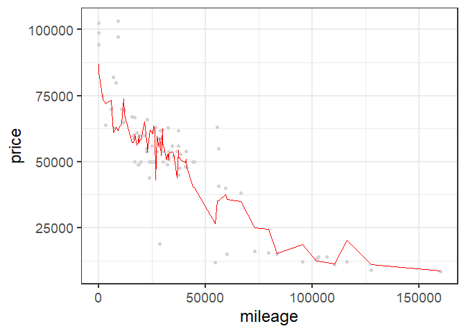
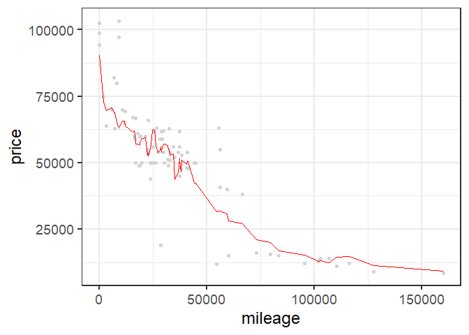
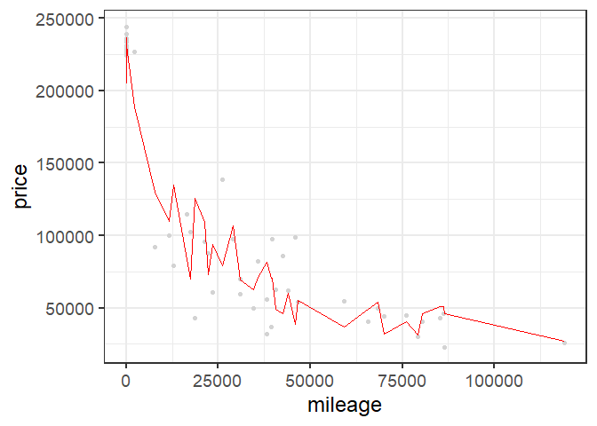
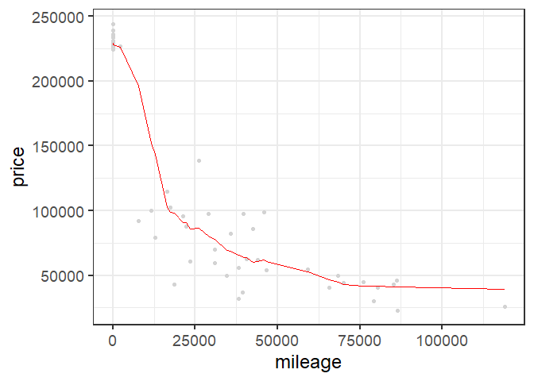
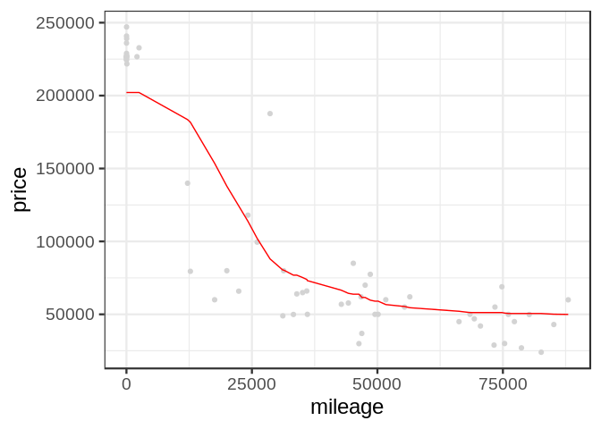

Exercise\_2
================

## GitHub Documents

This is an R Markdown format used for publishing markdown documents to
GitHub. When you click the **Knit** button all R code chunks are run and
a markdown file (.md) suitable for publishing to GitHub is generated.

## Including Code

    ## [1] 416  17

<!-- -->

    ## [1] 10449.63

<!-- -->

    ## [1] 10453.46

<!-- -->

    ## [1] 10205.82

<!-- -->

    ## [1] 10000.8

<!-- -->

    ## [1] 9941.392

<!-- -->

    ## [1] 11122.99

<!-- -->

    ## [1] 19109.21

<!-- -->

    ## [1] 9860.415

# sclass\_65

    ## [1] 292  17

<!-- -->

    ## [1] 29741.1

<!-- -->

    ## [1] 26869.01

<!-- -->

    ## [1] 25077.47

<!-- -->

    ## [1] 24355.71

<!-- -->

    ## [1] 31952.69

<!-- -->

    ## [1] 46368.29

<!-- -->

    ## [1] 76001.5

<!-- -->

    ## [1] 24355.71
