Exercise\_2
================

## GitHub Documents

This is an R Markdown format used for publishing markdown documents to
GitHub. When you click the **Knit** button all R code chunks are run and
a markdown file (.md) suitable for publishing to GitHub is generated.

## Including Code

    ## [1] 416  17

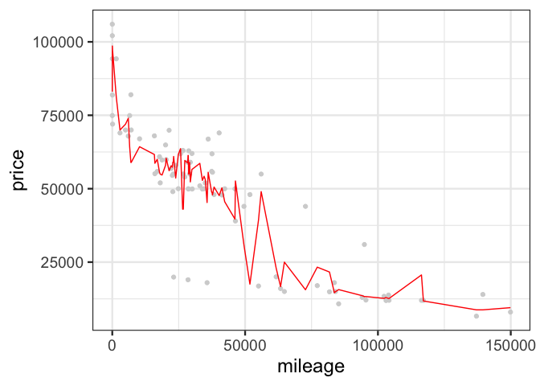<!-- -->

    ## [1] 12632.29

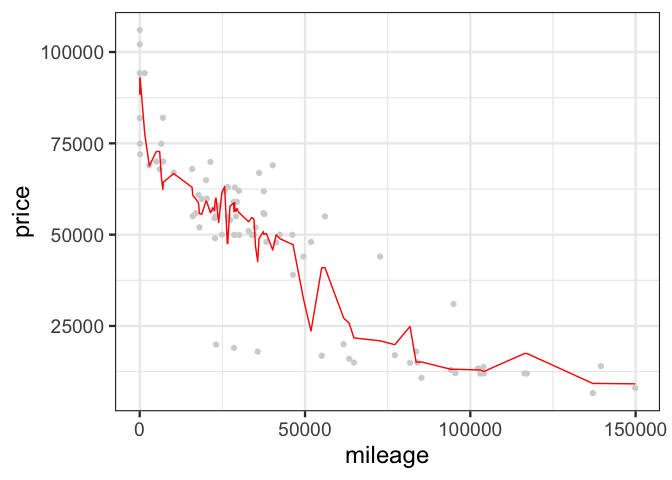<!-- -->

    ## [1] 11444.69

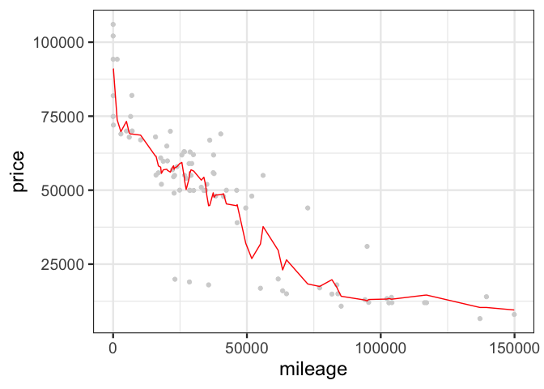<!-- -->

    ## [1] 10855.64

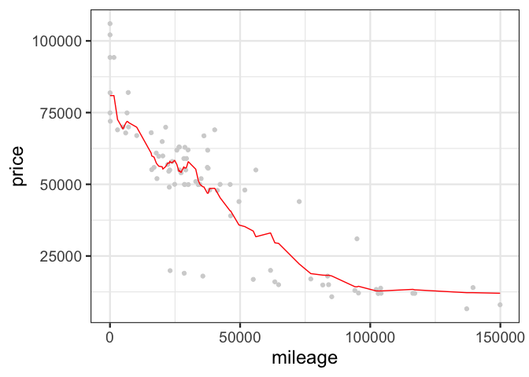<!-- -->

    ## [1] 11010.26

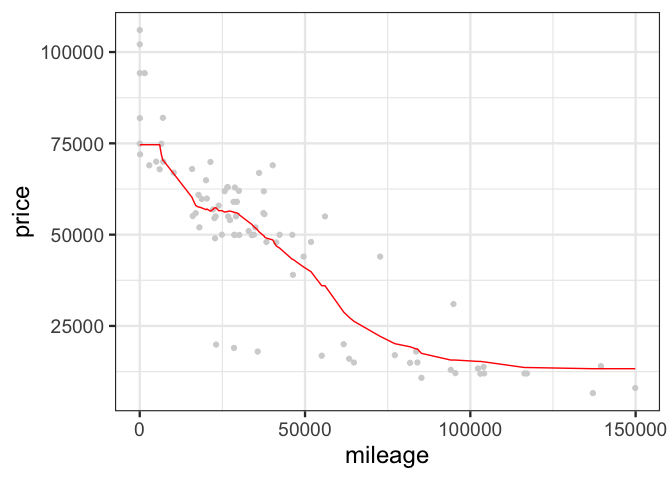<!-- -->

    ## [1] 11239.36

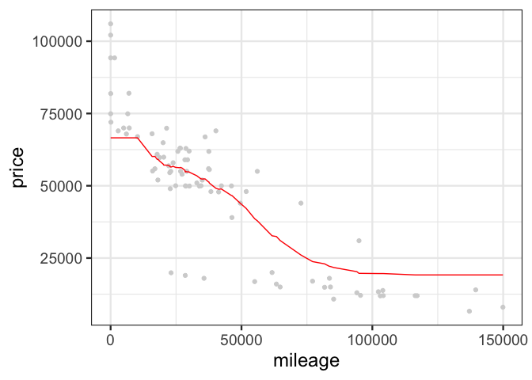<!-- -->

    ## [1] 12662.22

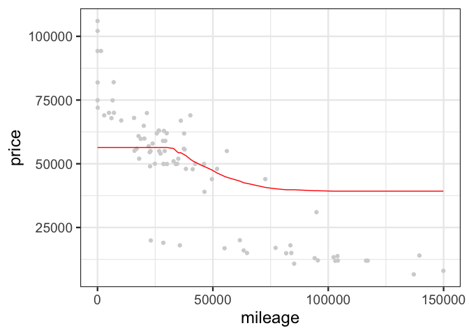<!-- -->

    ## [1] 19099

## hallo

    ## [1] 292  17

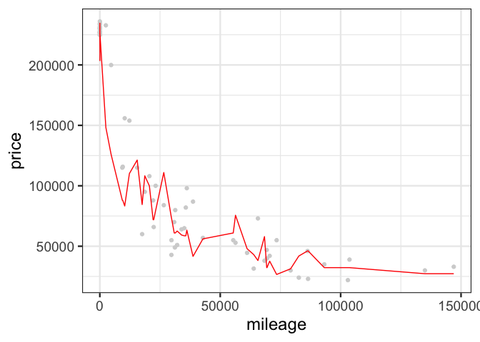<!-- -->

    ## [1] 24504.61

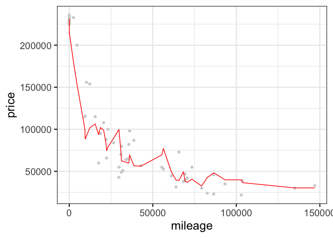<!-- -->

    ## [1] 21642.07

<!-- -->

    ## [1] 17967.07

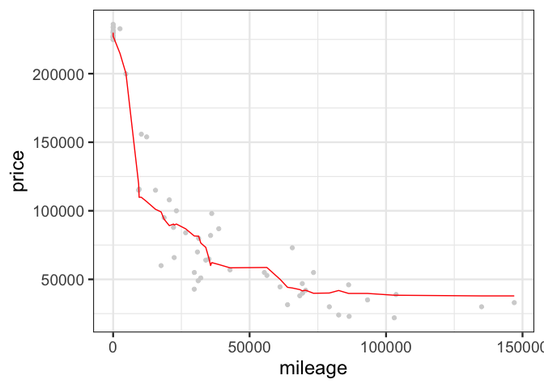<!-- -->

    ## [1] 16875.61

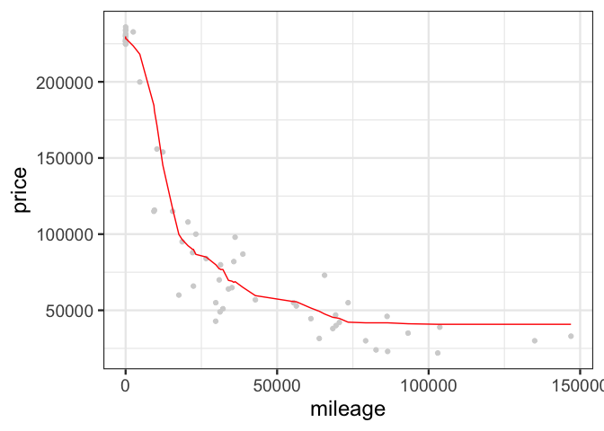<!-- -->

    ## [1] 18564.92

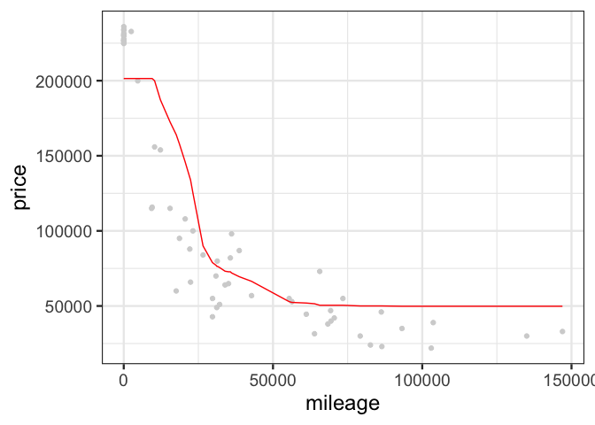<!-- -->

    ## [1] 33589.44

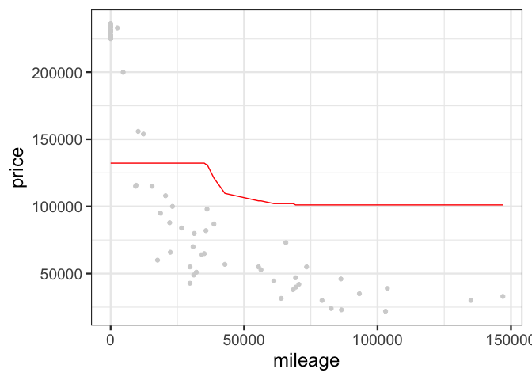<!-- -->

    ## [1] 70287.56
